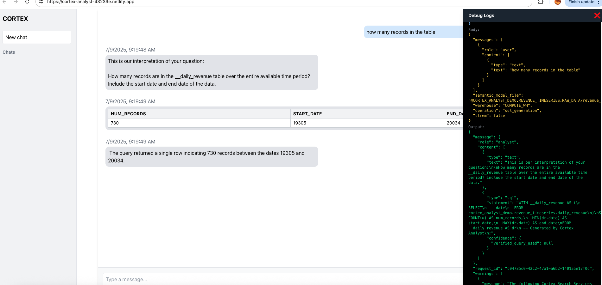

# Cortex Analyst + Cortex Complete with React UI

Cortex Analyst + Cortex Complete is a modern React application designed for advanced data analysis and interactive chat with Snowflake integration.

## Features

- Interactive chat interface for querying Snowflake
- Real-time data analysis and visualization
- Modern, responsive UI built with React and Vite
- Easy integration and extensibility

## Getting Started

### Prerequisites
- Node.js (v18 or higher recommended)
- npm or yarn

### Configuration
Before running the application, you must configure your Snowflake account URL and set your Personal Access Token (PAT):

1. **Set your Snowflake Account URL**
   - Locate the configuration file or environment variable where the Snowflake account URL is set (commonly in `.env` or a config section in the code).
   - Replace the placeholder with your Snowflake account URL.

2. **Set your PAT Token**
   - Locate where the PAT token is referenced in the code or environment variables.
   - Replace the placeholder with your own PAT token.

#### How to Create a Snowflake PAT Token
1. Log in to your Snowflake account.
2. Navigate to your user profile or security settings.
3. Find the section for Personal Access Tokens (PAT) or API tokens.
4. Click "Create New Token" or similar option.
5. Save the generated token securely. You will use this token in your application configuration.

> **Note:** Never commit your PAT token or sensitive credentials to source control.

### Installation
```bash
npm install
```

### Running the App
```bash
npm run dev
```

The app will start on `http://localhost:5173` by default.

## Screenshots


*Chat interface for querying Snowflake.*


*Example data visualization output.*

## Project Structure
- `src/` - React components and main application logic
- `public/` - Static assets
- `data/` - Demo CSV data files

## Creating the Snowflake Objects

Use Snowsight, the Snowflake UI, to create the Snowflake objects needed for this project. After you complete your work, you can drop these objects.

> **Note:** Use a role that can create databases, schemas, warehouses, stages, and tables.

### Steps
1. In the Snowsight user interface, select **Worksheets** in the left navigation bar, then select the **+** button to open a new SQL worksheet.
2. Paste the SQL code below into the worksheet.
3. Select **Run All** from the drop-down menu at the top right of the worksheet.

```sql
/*--
• Database, schema, warehouse, and stage creation
--*/

USE ROLE SECURITYADMIN;

CREATE ROLE IF NOT EXISTS cortex_user_role;
GRANT DATABASE ROLE SNOWFLAKE.CORTEX_USER TO ROLE cortex_user_role;

GRANT ROLE cortex_user_role TO USER <user>;

USE ROLE sysadmin;

-- Create demo database
CREATE OR REPLACE DATABASE cortex_analyst_demo;

-- Create schema
CREATE OR REPLACE SCHEMA cortex_analyst_demo.revenue_timeseries;

-- Create warehouse
CREATE OR REPLACE WAREHOUSE cortex_analyst_wh
    WAREHOUSE_SIZE = 'large'
    WAREHOUSE_TYPE = 'standard'
    AUTO_SUSPEND = 60
    AUTO_RESUME = TRUE
    INITIALLY_SUSPENDED = TRUE
COMMENT = 'Warehouse for Cortex Analyst demo';

GRANT USAGE ON WAREHOUSE cortex_analyst_wh TO ROLE cortex_user_role;
GRANT OPERATE ON WAREHOUSE cortex_analyst_wh TO ROLE cortex_user_role;

GRANT OWNERSHIP ON SCHEMA cortex_analyst_demo.revenue_timeseries TO ROLE cortex_user_role;
GRANT OWNERSHIP ON DATABASE cortex_analyst_demo TO ROLE cortex_user_role;


USE ROLE cortex_user_role;

-- Use the created warehouse
USE WAREHOUSE cortex_analyst_wh;

USE DATABASE cortex_analyst_demo;
USE SCHEMA cortex_analyst_demo.revenue_timeseries;

-- Create stage for raw data
CREATE OR REPLACE STAGE raw_data DIRECTORY = (ENABLE = TRUE);

/*--
• Fact and Dimension Table Creation
--*/

-- Fact table: daily_revenue
CREATE OR REPLACE TABLE cortex_analyst_demo.revenue_timeseries.daily_revenue (
    date DATE,
    revenue FLOAT,
    cogs FLOAT,
    forecasted_revenue FLOAT,
    product_id INT,
    region_id INT
);

-- Dimension table: product_dim
CREATE OR REPLACE TABLE cortex_analyst_demo.revenue_timeseries.product_dim (
    product_id INT,
    product_line VARCHAR(16777216)
);

-- Dimension table: region_dim
CREATE OR REPLACE TABLE cortex_analyst_demo.revenue_timeseries.region_dim (
    region_id INT,
    sales_region VARCHAR(16777216),
    state VARCHAR(16777216)
);
```

This SQL creates the following objects:
- A database named `cortex_analyst_demo`
- A schema within that database called `revenue_timeseries`
- Three tables in that schema: `daily_revenue`, `product_dim`, and `region_dim`
- A stage named `raw_data` that will hold the raw data loaded into these tables
- A virtual warehouse named `cortex_analyst_wh`

## Loading Data into Snowflake

To get the data from the CSV files into Snowflake, you will upload them to the stage, then load the data from the stage into the tables. At the same time, you will upload the semantic model YAML file for use in a later step.
Download the files from \data folder

The files you will upload are:
- `daily_revenue.csv`
- `product.csv`
- `region.csv`
- `revenue_timeseries.yaml`

### To upload the files in Snowsight:
1. In the Snowsight UI, select the **Data** icon in the left navigation bar, then **Add Data**. In the Add Data page, select **Load files into a stage**.
2. Drag the four files you downloaded in the previous step into the Snowsight window.
3. Choose the database `cortex_analyst_demo` and the stage `raw_data`, then select the **Upload** button to upload the files.

Now that you have uploaded the files, load the data from the CSV files by executing the SQL commands below in a Snowsight worksheet:

```sql
USE WAREHOUSE cortex_analyst_wh;

COPY INTO cortex_analyst_demo.revenue_timeseries.daily_revenue
FROM @raw_data
FILES = ('daily_revenue.csv')
FILE_FORMAT = (
    TYPE=CSV,
    SKIP_HEADER=1,
    FIELD_DELIMITER=',',
    TRIM_SPACE=FALSE,
    FIELD_OPTIONALLY_ENCLOSED_BY=NONE,
    REPLACE_INVALID_CHARACTERS=TRUE,
    DATE_FORMAT=AUTO,
    TIME_FORMAT=AUTO,
    TIMESTAMP_FORMAT=AUTO
    EMPTY_FIELD_AS_NULL = FALSE
    error_on_column_count_mismatch=false
)
ON_ERROR=CONTINUE
FORCE = TRUE ;

COPY INTO cortex_analyst_demo.revenue_timeseries.product_dim
FROM @raw_data
FILES = ('product.csv')
FILE_FORMAT = (
    TYPE=CSV,
    SKIP_HEADER=1,
    FIELD_DELIMITER=',',
    TRIM_SPACE=FALSE,
    FIELD_OPTIONALLY_ENCLOSED_BY=NONE,
    REPLACE_INVALID_CHARACTERS=TRUE,
    DATE_FORMAT=AUTO,
    TIME_FORMAT=AUTO,
    TIMESTAMP_FORMAT=AUTO
    EMPTY_FIELD_AS_NULL = FALSE
    error_on_column_count_mismatch=false
)
ON_ERROR=CONTINUE
FORCE = TRUE ;

COPY INTO cortex_analyst_demo.revenue_timeseries.region_dim
FROM @raw_data
FILES = ('region.csv')
FILE_FORMAT = (
    TYPE=CSV,
    SKIP_HEADER=1,
    FIELD_DELIMITER=',',
    TRIM_SPACE=FALSE,
    FIELD_OPTIONALLY_ENCLOSED_BY=NONE,
    REPLACE_INVALID_CHARACTERS=TRUE,
    DATE_FORMAT=AUTO,
    TIME_FORMAT=AUTO,
    TIMESTAMP_FORMAT=AUTO
    EMPTY_FIELD_AS_NULL = FALSE
    error_on_column_count_mismatch=false
)
ON_ERROR=CONTINUE
FORCE = TRUE ;
```

## License
MIT
